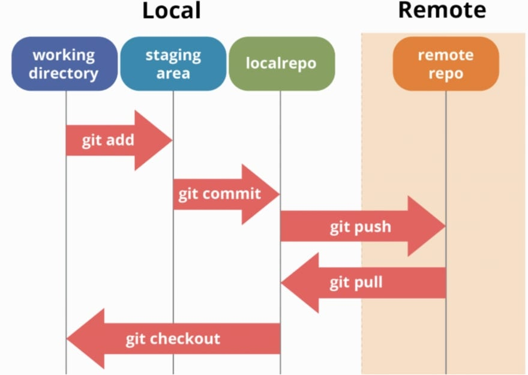
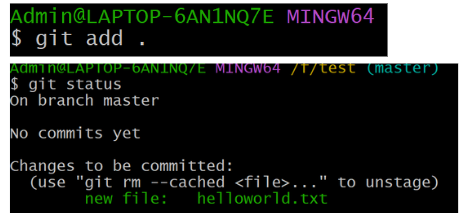
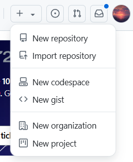
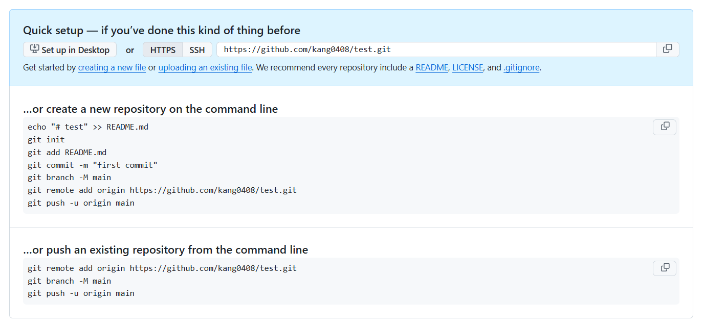
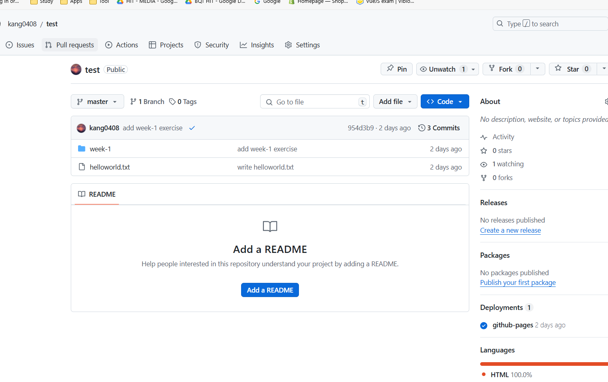
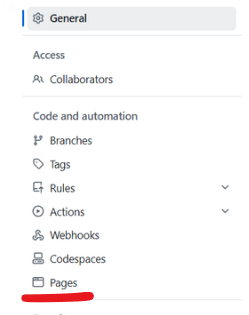
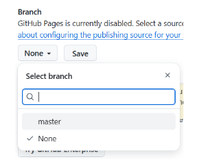

# WEB-PRIVATE-2025 - WEEK 1

---

## [Home](../README.html)

---

## Nội dung

### [I. Cài đặt IDE, Extensions](#i-cài-đặt-ide-extensions)

[1. IDE](#1-ide)

[2. Extensions](#2-extensions)

### [II. Git & Github](#ii-git--github)

[1. Git](#1-git)

[2. Github](#2-github)

### [III. HTML, CSS & Javascript](#iii-html-css--javascript)

[1. HTML](#1-html)

[2. CSS](#2-css)

[3. Javascript](#3-javascript)

---

## I. Cài đặt IDE, Extensions

### 1. IDE

[Visual Studio Code](https://code.visualstudio.com/Download)

### 2. Extensions

- [HTML CSS Support](https://marketplace.visualstudio.com/items?itemName=ecmel.vscode-html-css)
- [Live server](https://marketplace.visualstudio.com/items?itemName=ritwickdey.LiveServer)
- [Auto Close Tag](https://marketplace.visualstudio.com/items?itemName=formulahendry.auto-close-tag)
- [Auto Rename Tag](https://marketplace.visualstudio.com/items?itemName=formulahendry.auto-rename-tag)

## II. Git & Github

### 1. Git

a. Git là gì?
Git là hệ thống quản lý phiên bản phân tán (VCS - Version Control System), giúp bạn theo dõi mọi thay đổi trong mã nguồn của dự án, từ đó có thể hợp và làm việc nhóm một cách dễ dàng và hiệu quả

b. Tại sao cần dùng Git

- Theo dõi sự thay đổi của dự án
- Dễ dàng quay lại phiên bản trước đó nếu có lỗi
- Hỗ trợ làm việc nhóm nhiều người trên cùng 1 dự án

c. Khái niệm cơ bản

- Repo (Repository): kho lưu trữ mã nguồn, nơi chứa toàn bộ các file và lịch sử thay đổi của dự án
  - Local repo: Đây là repo được thiết lập trên máy của lập trình viên và dành cho 1 người sử dụng
  - Remote repo: Đây là repo để chia sẽ giữa nhiều người và bố trí trên server chuyên dụng
- Branch: Tương tự như một workspace mới mà không ảnh hưởng tới nhánh chính
- Commit: là hành động ghi lại sự thay đổi trong repo của bạn
- Clone: là hành động tải một bản sao có sẵn của một remote repo server nào đó có sẵn
- Push: là hành động đưa các commit từ local repo lên remote repo



d. Cài đặt và cấu hình

1. [Download Git](https://git-scm.com/downloads?ref=blog.haposoft.com)
2. Thiết lập thông tin cá nhân trên git

   Mục đích của việc thiết lập thông tin cá nhân trên Git (bao gồm tên và địa chỉ email) là để Git có thể xác định người thực hiện các hành động trong quá trình quản lý phiên bản (version control). Tức là khi thực hiện một commit trong Git, thông tin cá nhân như tên và email sẽ được ghi lại cùng với commit đó.

   ```git
   git config --global user.name "Tên của bạn"
   git config --global user.email "email@example.com"
   git config --list
   ```

   - Mở `Git Bash` trên window. Gõ 2 lệnh đầu tiên để thiết lập thông tin tên và email. Sau đó gõ lệnh thứ 3, phóng to màn hình terminal sẽ thấy thông tin ở 2 dòng cuối.
   - Nhấn phím `Q` trên bàn phím để có thể tiếp tục gõ lệnh

   

3. Khởi tạo git

   ```git
   git init
   ```

   Được sử dụng để khởi tạo một kho lưu trữ Git mới (Git repository) trong thư mục hiện tại.

   - Tạo mới một thư mục
   - Vào thư mục và nhấn chuột phải chọn `Git Bash`

   

   - Gõ lệnh

   

   Sau khi gõ lệnh trên, trong thư mục vừa tạo sẽ xuất hiện một thư mục ẩn `.git`.
   Nếu không thấy có thể vào `View` để hiển thị thư mục ẩn

   

4. Kiểm tra trạng thái
   Kiểm tra sự thay đổi trong dự án

   ```git
   git status
   ```

   Trong thư mục vừa tạo, hãy tạo ra file `.txt`, sau đó tiếp tục gõ lệnh trên vào terminal và sẽ có kết quả như hình dưới đây:

   

   Hình ảnh trên là git thông báo về sự thay đổi xảy ra trong thư mục đó

5. Thêm file vào vùng lưu trữ tạm (staging area)

   ```git
   git add <file>
   git add .
   ```

   - Có 2 cách thêm file vào vùng lưu trữ. Với cách 1 sẽ thêm thêm từng file với tên cụ thể. Còn cách 2 sẽ thêm tất cả các thay đổi vào vùng tạm
   - Mục đích: Quá trình này cho phép kiểm soát và quản lý những gì sẽ được đưa vào một commit, thay vì phải commit toàn bộ các thay đổi ngay lập tức, giúp tạo ra những commit rõ ràng và có ý nghĩa

   

6. Commit
   ```git
   git commit -m "Mô tả đặt ở đây"
   ```
   `git commit` có mục đích ghi lại những thay đổi đã được thêm vào vùng tạm (Staging Area) giống như việc chụp lại sự thay đổi của dự án tại 1 thời điểm nhất định
   
7. Xem lịch sử commit
   ```git
   git log
   ```
   Sử dụng để hiển thị lịch sử commit của dự án, cho phép bạn xem chi tiết về các commit đã được thực hiện.
   

### 2. Github

a. Github là gì?
GitHub là một nền tảng dựa trên web được thiết kế để lưu trữ mã nguồn và hỗ trợ quản lý phiên bản (version control) bằng cách sử dụng Git. Nó cung cấp không gian lưu trữ cho các dự án mã nguồn (repository) và các công cụ để quản lý, theo dõi và làm việc trong các dự án phần mềm.
b. Liên kết Git và Github

- Khi liên kết Git và Github, mã nguồn sẽ được lưu trữ online, tức bạn có thể truy cập đến mã nguồn của mình từ bất cứ đâu, chỉ cần có mạng Internet
- Giúp sao lưu dữ liệu tránh trường hợp dữ liệu bị mất hay máy tính hỏng học
- Giúp chia sẻ mã nguồn và làm việc nhóm với các công cụ, tính năng giúp kiểm soát mã nguồn, xử lý lỗi

1. Tạo tài khoản github, đăng nhập và khởi tạo repo
   Sau khi đăng nhập thành công, có 2 cách để tạo repo như hình dưới.

   

   

   Sau khi nhập các thông tin như tên repo cùng các lựa chọn sau đó và tạo thành công repo sẽ hiển thị một trang như hình dưới đây:

   

2. Liên kết với Github

   ```git
   git remote add origin <link repo>
   ```

   Tiếp tục với terminal đang dùng ở phía trên, gõ lệnh trên vào với đường link repo vừa tạo:

   

   ```git
   git remote -v
   ```

   Sau đó, tiếp tục gõ lệnh trên để kiểm tra xem local repo ở máy bạn đã được liên kết đến remote repo trên github hay chưa, nếu hiển thị kết quả như trong hình nghĩa là đã liên kết thành công.

   

3. Đẩy mã nguồn lên Github

   ```git
   git push -u origin <branch>
   ```

   - Được sử dụng để đẩy các commit từ kho lưu trữ Git cục bộ (local repository) lên kho lưu trữ từ xa (remote repository)
   - Chú ý phần `<branch>` này sẽ là tên nhánh chính. Thường là `master` hoặc `main` và được xác định ở đây

   

   - Sau khi thực hiện lệnh sẽ có kết quả như sau. Tiếp đó bạn hay refresh lại trang repo bạn vừa tạo trên github để thấy được kết quả
     

   

4. Github Page

   - Đầu tiên hãy vào trang [html này](https://raw.githubusercontent.com/kang0408/test/refs/heads/master/week-1/index.html) này
   - Chuột phải chọn `Save as` để tải file `index.html` về máy
   - Tạo 1 folder `week-1` trong folder bạn vừa tạo, đặt file `index.html` vừa tải về vào đó và đẩy folder `week-1` lên repo trên github theo hướng dẫn như trên.
     Kết quả thành công khi trên repo có 1 folder `week-1`, khi bấm vào nó sẽ có 1 file `index.html`

   - Tìm đến Settings trong repo của bạn
     
   - Vào Pages
     
     
     

     Chọn nhánh `master` và "Save"

   - Đợi 1 lát và load lại trang sẽ có kết quả như sau, nhấn `Visit site`
     
     Nhấn "Visit site"
   - Quay lại thư mục `week-1`, tìm tới file `index.html` và copy path

     

   - Quay lại Github pages, paste vào đường link rồi enter sẽ có kết quả như sau:

     

## III. HTML, CSS & Javascript

### 1. HTML

- HTML (HyperText Markup Language) là ngôn ngữ đánh dấu được sử dụng để tạo cấu trúc và nội dung cho một trang web.
- HTML không phải là ngôn ngữ lập trình mà là ngôn ngữ đánh dấu để sắp xếp các thành phần như văn bản, hình ảnh, liên kết, biểu mẫu, và các nội dung khác trên trang web.

### 2. CSS

- CSS (Cascading Style Sheets) là ngôn ngữ dùng để mô tả cách hiển thị của các phần tử HTML trên trang web.
- Nó quyết định về bố cục, màu sắc, kiểu chữ, kích thước, khoảng cách giữa các phần tử, v.v. CSS giúp trang web trông trực quan và dễ nhìn hơn.

### 3. Javascript

- JavaScript là ngôn ngữ lập trình cho phép tương tác và xử lý các hành vi động trên trang web. Với JavaScript, bạn có thể tạo ra các tính năng như xử lý sự kiện, thay đổi nội dung của trang, kiểm tra dữ liệu đầu vào của người dùng, và nhiều hơn nữa.
- JavaScript làm cho trang web trở nên tương tác, sinh động và thân thiện với người dùng hơn.
