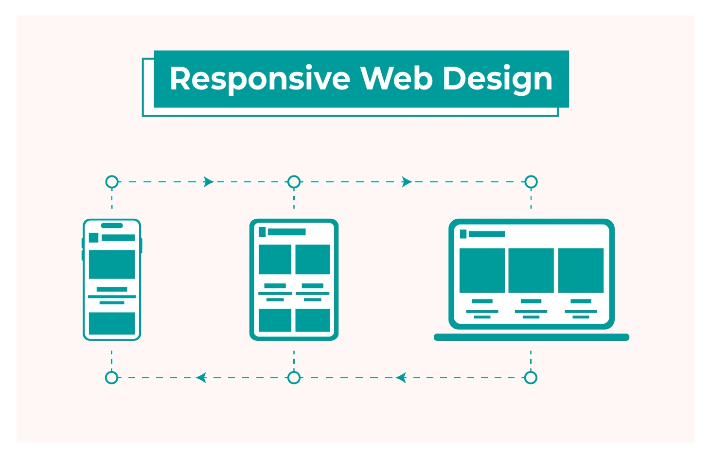
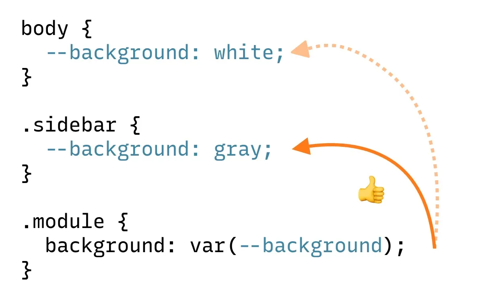
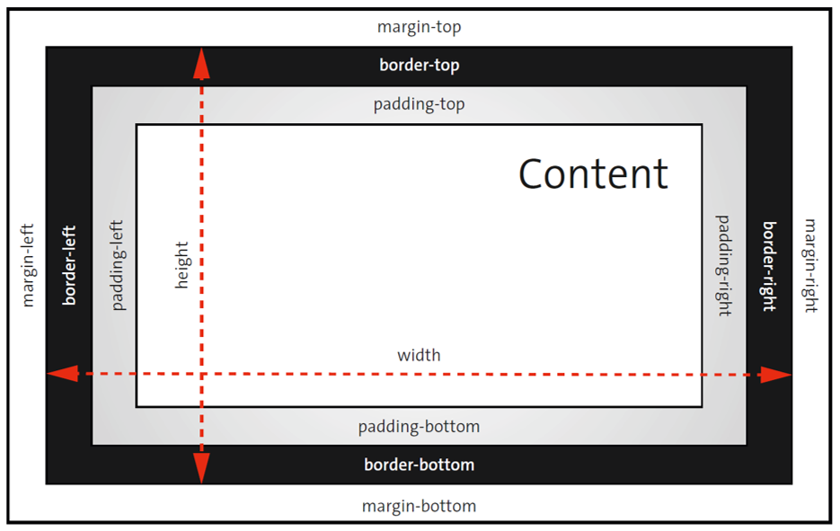
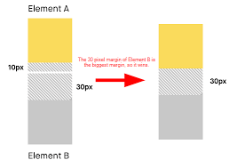
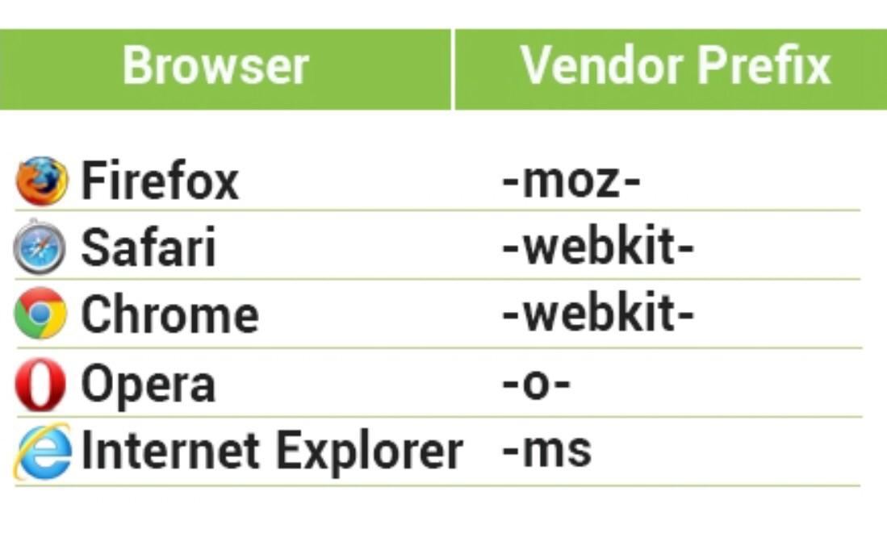

# WEB-PRIVATE-2025 - WEEK 3.1

---

## Nội dung

### [I. Responsive Design](#i-responsive-design)
### [II. Media Queries](#ii-media-queries)
### [III. Custom Properties](#iii-custom-properties)
### [IV. Hàm Trong CSS](#iv-hàm-trong-css)
### [V. Box Model nâng cao](#v-box-model-nâng-cao)
### [VI. Vendor Prefix](#vi-vendor-prefix)

---
## I. Responsive Design

- Định nghĩa: Responsive Web Design (RWD) là phương pháp thiết kế giao diện web sao cho trang web tự động điều chỉnh bố cục, kích thước và vị trí các phần tử phù hợp với nhiều kích thước màn hình (điện thoại, máy tính bảng, laptop, desktop).

- Tăng trải nghiệm người dùng: người dùng không cần phóng to/thu nhỏ hay cuộn ngang để xem hết nội dung.

- Giảm công sức bảo trì: chỉ cần một mã nguồn HTML/CSS duy nhất nhưng thích nghi được với nhiều thiết bị.

Các thành tố chính:

1. Grid linh hoạt (Fluid Grid): dùng phần trăm (%) thay vì giá trị cố định (px) cho chiều rộng các cột/khối.

2. Hình ảnh và media linh hoạt (Flexible Media): thiết lập hình ảnh, video… có độ rộng tối đa max-width: 100% để co dãn theo container.

3. __Media Queries__: câu lệnh CSS cho phép áp dụng styles khác nhau tùy thuộc vào đặc tính thiết bị (như kích thước màn hình, độ phân giải).



Nguồn chi tiết hơn: 👉 [Ở đây!](https://www.w3schools.com/html/html_responsive.asp)

## II. Media Queries

- Định nghĩa: Media Queries (MQ) là tính năng trong CSS3, cho phép chọn lọc (query) đặc tính của thiết bị (ví dụ: độ rộng, độ cao màn hình, hướng màn hình…) và áp dụng các quy tắc CSS riêng biệt khi điều kiện thỏa mãn.

- Cú pháp cơ bản:

```
    @media <loại-phương-tiện> and (<điều-kiện>) {
    /* CSS rules ở đây */
    }
```

`<loại-phương-tiện>` thường là screen, print,…

`<điều-kiện>` ví dụ `max-width: 768px`, orientation: landscape,…

### Ví dụ
Giả sử bạn có layout 3 cột trên desktop, nhưng muốn chuyển thành 1 cột trên màn hình nhỏ:
```
/* Styles mặc định cho desktop */
.container {
  display: grid;
  grid-template-columns: repeat(3, 1fr);
  gap: 20px;
}

/* Khi màn hình tối đa 768px, chuyển thành 1 cột */
@media screen and (max-width: 768px) {
  .container {
    grid-template-columns: 1fr;
  }
}

```

### Một số lưu ý

- Mobile-first: viết CSS cho mobile (nhỏ nhất) trước, sau đó dùng @media (min-width: …) để mở rộng cho màn hình lớn hơn.

```
/* Mobile styles mặc định */
.menu { display: none; }

/* Khi ≥768px thì hiển thị menu */
@media (min-width: 768px) {
  .menu { display: block; }
}
```

## III. Custom Properties
- Định nghĩa: Custom Properties (hay CSS Variables) là cách khai báo biến trong CSS, cho phép lưu lại giá trị (màu sắc, kích thước, font, v.v.) và tái sử dụng nhiều lần trong stylesheet.



- Bạn có thể cung cấp giá trị thay thế khi biến chưa xác định:

```
 color: var(--text-color, #333); /* nếu --text-color không có, dùng #333 */ 
```

### Kết hợp với Media Queries & JavaScript

- Media Queries: thay đổi biến tùy theo kích thước màn hình

```
:root {
  --font-size: 16px;
}

@media (min-width: 768px) {
  :root {
    --font-size: 18px;
  }
}

body {
  font-size: var(--font-size);
}
```

## VI. Hàm trong CSS

- Cú pháp cơ bản

``` 
selector {
  property: function-name(arg1, arg2, …);
}
```

- `calc()`: phép tính số học với các đơn vị khác nhau

```
width: calc(100% - 2rem);
font-size: calc(1rem + 0.5vw);
```

- `min()`, `max()`, `clamp()`
```
/* Lấy giá trị nhỏ nhất trong danh sách */
width: min(50vw, 400px);

/* Lấy giá trị lớn nhất */
height: max(200px, 10vh);

/* Giới hạn giữa min, giá trị ưu tiên, max */
font-size: clamp(1rem, 2.5vw, 2rem);
```

## V. Box Model nâng cao
### 1. Standard vs Alternative Box Model

- Standard Box Model: khi width và height được thiết lập, chúng chỉ áp dụng cho content-box, còn padding và border sẽ được cộng thêm vào để tính tổng kích thước hiển thị   .


- Alternative Box Model (box-sizing: border-box): toàn bộ padding và border được tính nội suy trong giá trị width và height, giúp tính toán kích thước hộp trực quan và đơn giản hơn.


### 2. Margin collapsing

- Margin collapsing là cơ chế tự hợp nhất hai lề dương chạm nhau thành một lề có kích thước bằng giá trị lớn nhất trong hai lề; nếu có lề âm, giá trị âm sẽ được trừ đi khi kết hợp


Nguồn chi tiết hơn: 👉 [Ở đây!](https://www.w3schools.com/css/css_margin_collapse.asp)

## VI. Vendor Prefix

`-webkit-` là một vendor prefix dùng để chỉ các thuộc tính CSS thử nghiệm hoặc mở rộng dành riêng cho các trình duyệt sử dụng engine WebKit/Blink (Safari, Chrome, Opera mới…) 
. Tiền tố này cho phép thử nghiệm sớm các tính năng CSS chưa được chuẩn hóa trên các trình duyệt mục tiêu, trước khi ngữ pháp cuối cùng được chốt bởi W3C 

1. Thuộc tính vẽ chữ (Text Stroke & Fill)

- `-webkit-text-stroke`: cho phép định nghĩa độ dày và màu viền chữ; Chrome không hỗ trợ `text-stroke` không prefix mà chỉ nhận `-webkit-text-stroke` .

- `-webkit-text-fill-color`: xác định màu nền (fill) của ký tự; bạn phải dùng prefix, vì `text-fill-color` không có hỗ trợ chính thức .

